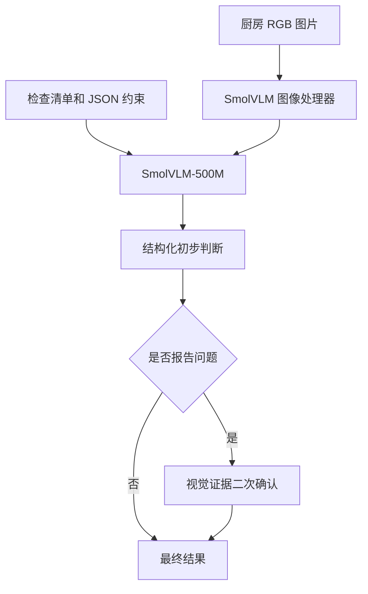

# 轻量厨房安全巡检助手

基于 `SmolVLM-500M-Instruct` 的厨房图片巡检项目。项目只使用一个不超过 0.5B
参数的视觉语言模型，不训练、不微调，也不调用付费 API。它支持 NYU Depth V2
厨房图片提取、人工筛选与标注、四种提示方法实验、三项指定指标评价和 Gradio Demo。

## 任务范围

系统只判断以下五种结果：

| 标签 | 含义 |
|---|---|
| `floor_obstruction` | 地面或通道存在明显杂物 |
| `countertop_clutter` | 厨房台面明显杂乱 |
| `unsafe_object_placement` | 物品摆放位置明显不合理 |
| `normal` | 没有发现明显问题 |
| `uncertain` | 图片模糊、遮挡严重或证据不足 |

如果同一张图片同时存在多个问题，只报告最明显的一项。

## 技术流程



`verified` 方法不是第二个模型，而是复用 `checklist` 的同一次初判，再使用同一个
SmolVLM 进行严格的视觉证据复核。只有复核回答 `yes` 时才保留问题，因此可以将
`checklist` 和 `verified` 逐图公平比较。Demo 为了展示完整依据和建议，使用结构化
初判并应用相同的二次确认逻辑。

## 项目结构

```text
home-inspection/
├── inspection/              # 提示词、推理、解析和评价核心代码
├── data/
│   ├── raw/                 # NYU .mat 文件，不提交 Git
│   ├── candidates/          # 导出的厨房候选图片
│   ├── debug/               # 提示词调试图片
│   └── test/                # 最终测试图片
├── results/                 # 预测、指标和代表性图片
├── tests/                   # 不依赖模型权重的自动化测试
├── download_data.py         # 下载约 2.8 GB 标注版数据
├── prepare_data.py          # 筛选 sceneTypes == kitchen 并导出 RGB
├── curate_data.py           # 人工筛选、划分和单标签标注界面
├── analyze_data.py          # 数量统计和 6—8 张代表图拼图
├── run_model.py             # 四种提示实验
├── evaluate.py              # Accuracy、误报数、JSON 合法率
└── app.py                   # Gradio 巡检 Demo
```

## 1. 环境安装

推荐 Windows 10/11、Python 3.10 或 3.11。首先在 PowerShell 中进入项目：

```powershell
cd D:\zhongpproject
py -3.11 -m venv .venv
.\.venv\Scripts\Activate.ps1
python -m pip install --upgrade pip
pip install -r requirements.txt
```

如果使用 NVIDIA GPU，建议先根据 [PyTorch 官方安装页](https://pytorch.org/get-started/locally/)
安装与本机 CUDA 匹配的 PyTorch，再安装其他依赖。没有 GPU 时程序会自动使用 CPU，
但批量实验耗时会明显增加。

检查运行设备：

```powershell
python -c "import torch; print('CUDA:', torch.cuda.is_available())"
```

## 2. 下载并导出厨房图片

只下载约 2.8 GB 的标注版 `.mat` 文件，不下载约 428 GB 的原始视频数据：

```powershell
python download_data.py
python prepare_data.py
```

`prepare_data.py` 会读取 `images` 和 `sceneTypes`，筛选场景类型严格等于 `kitchen`
的 RGB 图片，并导出到 `data/candidates/`。同时会生成包含尺寸与简单清晰度分数的
`data/candidates.jsonl`。

数据来源：[NYU Depth Dataset V2](https://cs.nyu.edu/~fergus/datasets/nyu_depth_v2.html)。

## 3. 人工筛选与标注

```powershell
python curate_data.py
```

浏览器会打开 `http://127.0.0.1:7861`。逐张完成以下操作：

1. 严重模糊、损坏或不适合作为实验样本的图片选择 `reject`；
2. 其他图片只选择一个主要标签；
3. 先选约 10—20 张 `debug`，再选约 20—40 张 `test`；
4. 不根据模型输出修改测试集人工标签。

程序会生成：

- `data/annotations.jsonl`：最终人工标注；
- `data/curation.jsonl`：包括被拒绝图片在内的审核记录；
- `data/debug/` 和 `data/test/`：筛选后的图片副本。

建议最终使用 15 张调试图和 30 张测试图，并尽量保证五类分布不过度失衡。

如果人工审核得到的有效图片超过 60 张，可以先保留完整标注，再使用固定随机种子
进行分层抽样：

```powershell
Copy-Item data\annotations.jsonl data\annotations_all_128.jsonl
python select_subset.py
```

脚本不会删除原始图片，会从完整标注池中选择 15 张调试图片和 30 张测试图片，
复制到 `data/selected/`，并将最终 45 张样本写入 `data/annotations.jsonl`。

## 4. 数据观察

```powershell
python analyze_data.py --representatives 8
```

输出：

- `results/data_analysis/dataset_summary.json`：图片数量、划分和类别统计；
- `results/data_analysis/representative_images.jpg`：8 张代表性图片拼图。

## 5. 运行提示词实验

先在调试集上检查提示词和程序：

```powershell
python run_model.py --split debug --methods all --output results/debug_predictions.jsonl
```

提示词确定后，不再根据测试结果修改提示词，然后运行测试集：

```powershell
python run_model.py --split test --methods all --output results/test_predictions.jsonl
```

第一次运行会从 Hugging Face 下载模型权重。可选方法如下：

| 方法 | 行为 |
|---|---|
| `direct` | 简单开放式提问，使用规则将回答映射为标签 |
| `checklist` | 明确三类检查清单，只输出一个标签 |
| `structured` | 检查清单并强制输出 JSON |
| `verified` | 复用同一次 `checklist` 初判，问题样本再进行证据确认 |

也可以只运行指定方法：

```powershell
python run_model.py --split test --methods structured,verified
```

固定设置包括 `do_sample=False` 和固定随机种子，减少重复实验的生成波动。

## 6. 计算指定指标

```powershell
python evaluate.py --predictions results/test_predictions.jsonl
```

生成 `results/metrics.json` 和 `results/metrics.csv`，包含：

- **Accuracy**：最终预测标签与人工标签严格一致的比例；
- **误报数量**：真实为 `normal`，却预测为三类问题之一的次数；
- **JSON 合法率**：模型原始输出无需清理即可被 `json.loads()` 解析的比例。

程序允许 Demo 对带 Markdown 代码块的 JSON 进行容错恢复，但这种输出在正式
JSON 合法率中仍记为不合法，避免指标虚高。

## 7. 启动 Demo

```powershell
python app.py
```

打开 `http://127.0.0.1:7860`，上传厨房图片并点击“开始巡检”。界面显示：

- 是否存在明显问题；
- 问题类别；
- 可见判断依据；
- 简单处理建议；
- 原始结构化结果和二次确认状态。

## 8. 运行测试

```powershell
pip install -r requirements-dev.txt
ruff check .
pytest
```

自动化测试覆盖 JSON 合法性口径、容错解析、标签解析、二次确认逻辑、三项指标和
NYU `.mat` RGB 轴顺序转换。测试不会下载模型或完整数据集。

## 模型与数据说明

- 模型：[HuggingFaceTB/SmolVLM-500M-Instruct](https://huggingface.co/HuggingFaceTB/SmolVLM-500M-Instruct)，Apache-2.0；
- 数据：[NYU Depth Dataset V2](https://cs.nyu.edu/~fergus/datasets/nyu_depth_v2.html)；
- NYU 数据引用：Nathan Silberman et al., *Indoor Segmentation and Support Inference from RGBD Images*, ECCV 2012；
- SmolVLM 引用：Andrés Marafioti et al., *SmolVLM: Redefining Small and Efficient Multimodal Models*, 2025。

本项目是课程考核性质的研究原型。小型视觉语言模型可能产生误判，不应直接用于
真实家庭中的高风险自动决策。
