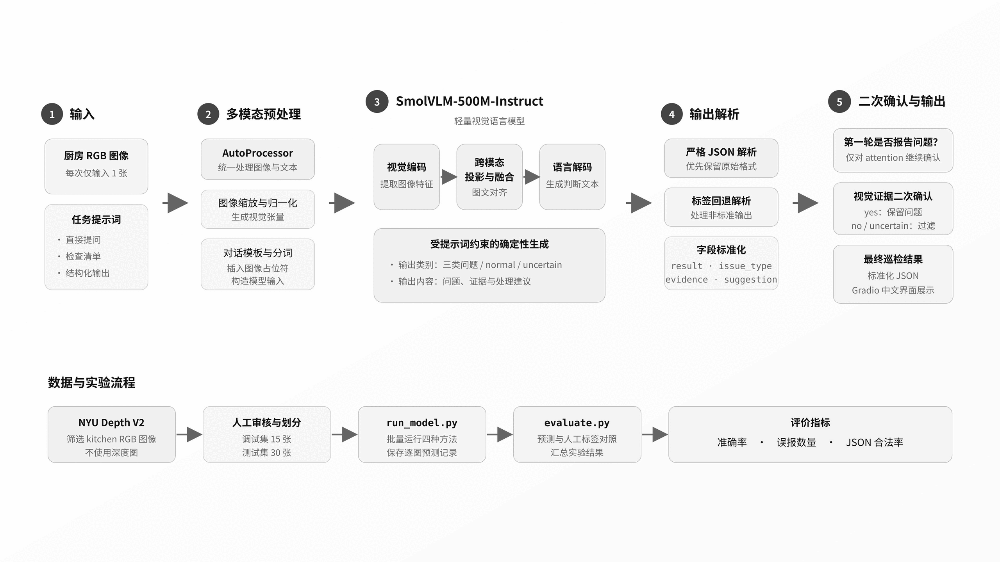

# 轻量厨房安全巡检助手

程序接收一张厨房图片，调用 `SmolVLM-500M-Instruct` 判断画面中是否存在以下问题：

- `floor_obstruction`：地面或行走通道存在杂物；
- `countertop_clutter`：厨房台面或水槽区域明显杂乱；
- `unsafe_object_placement`：物品与热源、水源或台面边缘存在明显的不安全位置关系。

没有发现上述问题时输出 `normal`；图片严重模糊、遮挡或无法判断时输出 `uncertain`。项目没有训练或微调模型，主要工作集中在数据整理、提示词设计、输出解析、二次确认和实验分析。

## 1. 运行效果

Demo 使用 Gradio 编写，支持上传单张厨房图片，并显示问题类别、判断依据和处理建议。界面中的“视觉证据二次确认”可以控制是否进行第二轮核验：

- 未勾选：使用结构化提示，直接生成 JSON 结果；
- 勾选：先使用 Checklist 判断，再让同一个模型确认图中是否有足够的视觉证据。

启动命令：

```powershell
.\.venv\Scripts\python.exe app.py --device cuda
```

浏览器访问 `http://127.0.0.1:7860` 即可使用。

## 2. 整体流程

<p align="center">
  
</p>

一次完整的巡检包含以下步骤：

1. 读取一张 RGB 厨房图片；
2. `AutoProcessor` 将图片和提示词整理为模型输入；
3. `SmolVLM-500M-Instruct` 生成文本结果；
4. `inspection/parsing.py` 解析标签、JSON 和确认回答；
5. `inspection/pipeline.py` 将结果统一为 `result`、`issue_type`、`evidence` 和 `suggestion`；
6. Demo 展示中文巡检结果，实验脚本将逐图记录保存为 JSONL。

模型加载代码位于 `inspection/model.py`。GPU 推理时会根据设备选择 `float16` 或 `bfloat16`，CPU 推理使用 `float32`。生成阶段关闭随机采样，便于重复实验。

## 3. 数据准备

实验图片来自 NYU Depth V2 标注数据，只使用场景类型为 `kitchen` 的 RGB 图片，不使用深度图，也不需要下载约 428 GB 的原始视频。

数据处理过程如下：

1. 下载 NYU Depth V2 标注版 `.mat` 文件；
2. 读取 RGB 图像和场景类型，导出厨房候选图片；
3. 人工删除损坏、严重模糊或不适合判断的图片；
4. 为有效图片标注五种标签之一；
5. 使用固定随机种子选出 15 张 Debug 图片和 30 张 Test 图片。

最终实验子集共 45 张：

| 标签 | 数量 |
|---|---:|
| `floor_obstruction` | 6 |
| `countertop_clutter` | 11 |
| `unsafe_object_placement` | 3 |
| `normal` | 21 |
| `uncertain` | 4 |

Debug 集只用于调整提示词；提示词确定后，再在 Test 集上运行一次最终实验。

相关脚本：

| 文件 | 用途 |
|---|---|
| `download_data.py` | 下载 NYU Depth V2 标注数据 |
| `prepare_data.py` | 筛选并导出 Kitchen RGB 图片 |
| `curate_data.py` | 人工查看图片并标注 |
| `review_annotations.py` | 复查已有标注 |
| `select_subset.py` | 按类别抽取 Debug/Test 子集 |
| `analyze_data.py` | 统计标签数量并生成代表性图片拼图 |

运行子集选择和数据统计：

```powershell
.\.venv\Scripts\python.exe select_subset.py
.\.venv\Scripts\python.exe analyze_data.py --representatives 8
```

原始数据和筛选后的图片体积较大，因此不上传 GitHub。仓库保留处理代码、目录占位文件、数据统计和实验结果。

## 4. 提示方法

本项目比较四种提示方法，四种方法使用相同的图片、模型和生成参数。

| 方法 | 做法 |
|---|---|
| `direct` | 直接询问图片中是否存在明显问题，作为开放式基线 |
| `checklist` | 给出三类问题的判断边界，要求模型只返回一个标签 |
| `structured` | 要求模型按照固定字段输出 JSON |
| `verified` | 在 Checklist 初判为问题后，再进行一次视觉证据确认 |

实际运行的提示词在 `inspection/prompts.py` 中，最终实验使用的副本保存在 `results/prompts_final.py`。

Checklist 对三类问题作了以下限制：

- 只有物品确实位于地面或行走路径时，才判断为 `floor_obstruction`；台面、水槽、炉灶和家电上的物品不属于这一类；
- 只有较多松散物品占据了明显的台面或水槽空间时，才判断为 `countertop_clutter`；少量日常用品和正常使用的沥水架不算明显杂乱；
- 判断 `unsafe_object_placement` 时，物品和危险位置关系必须同时可见，不能只看到某件物品就推断存在危险。

二次确认只在第一轮报告问题时执行。第二轮回答 `yes` 才保留原判断；回答 `no` 时改为 `normal`；回答 `uncertain` 时保留为无法确定。

## 5. 输出格式

结构化结果包含四个字段：

```json
{
  "result": "attention",
  "issue_type": "floor_obstruction",
  "evidence": "A plate is visible on the walking path.",
  "suggestion": "Remove the plate from the walking path."
}
```

- `result`：`normal`、`attention` 或 `uncertain`；
- `issue_type`：三类问题之一，正常或无法判断时为空；
- `evidence`：模型给出的可见依据；
- `suggestion`：对应的简单处理建议。

小模型有时无法严格生成 JSON，因此解析程序同时支持标准 JSON、标签文本和常见回答形式。`raw_json_valid` 单独记录原始输出能否被 JSON 解析器直接读取，后处理生成的合法结果不会被算作原始 JSON 合法。

## 6. 实验运行

在测试集上运行四种方法：

```powershell
.\.venv\Scripts\python.exe run_model.py `
    --split test `
    --methods direct,checklist,verified,structured `
    --device cuda `
    --output results\test_final_predictions.jsonl
```

计算评价指标：

```powershell
.\.venv\Scripts\python.exe evaluate.py `
    --predictions results\test_final_predictions.jsonl `
    --output results\test_final_metrics.json
```

评价内容包括：

- Accuracy：预测标签与人工标注一致的比例；
- 正常图误报数：标注为 `normal`，但模型判断存在问题的次数；
- JSON 合法率：结构化方法的原始输出可以直接解析为 JSON 的比例。

## 7. 最终结果

下表为 30 张 Test 图片上的结果：

| 方法 | Accuracy | 正常图误报数 | JSON 合法率 |
|---|---:|---:|---:|
| Direct | 0.4667（14/30） | 0 | — |
| Checklist | 0.2000（6/30） | 8 | — |
| Checklist + Verification | 0.3000（9/30） | 5 | — |
| Structured | **0.5667（17/30）** | **3** | **0.8667（26/30）** |

这组实验中，Structured 的准确率最高。二次确认把 Checklist 的正常图误报从 8 次降到了 5 次，同时多判断正确了 3 张图片，说明核验步骤能够过滤一部分证据不足的判断。

失败情况也比较明显：模型容易把普通台面物品判断为杂乱，对地面物体和危险位置关系的识别不稳定；`unsafe_object_placement` 样本较少，也增加了评价结果的不确定性。这些现象会在 `results/case_analysis.md` 中结合具体图片说明。

最终结果文件：

```text
results/
├── test_final_predictions.jsonl
├── test_final_metrics.json
├── test_final_metrics.csv
├── prompts_final.py
├── case_analysis.md
└── data_analysis/
    └── dataset_summary.json
```

## 8. 项目结构

```text
home-inspection/
├── inspection/
│   ├── model.py             # 模型加载和单图生成
│   ├── pipeline.py          # 四种实验方法和二次确认流程
│   ├── prompts.py           # 提示词
│   ├── parsing.py           # 输出解析
│   └── schemas.py           # 标签和结果数据结构
├── data/
│   ├── raw/                 # 原始 .mat 文件（不上传）
│   ├── candidates/          # 厨房候选图片（不上传）
│   └── selected/            # Debug/Test 图片（不上传）
├── results/                 # 指标、预测记录和案例分析
├── tests/                   # 单元测试
├── docs/
│   └── model_architecture.png
├── run_model.py
├── evaluate.py
├── app.py
├── requirements.txt
└── requirements-dev.txt
```

## 9. 环境安装

实验环境为 Windows 11、Python 3.11、RTX 4050 Laptop GPU（6 GB）。CPU 也可以运行，但速度会慢一些。

```powershell
python -m venv .venv
.\.venv\Scripts\Activate.ps1
.\.venv\Scripts\python.exe -m pip install -r requirements.txt
```

如果需要运行测试和代码检查，再安装开发依赖：

```powershell
.\.venv\Scripts\python.exe -m pip install -r requirements-dev.txt
.\.venv\Scripts\python.exe -m pytest
.\.venv\Scripts\python.exe -m ruff check .
```

当前版本的检查结果为 `21 passed`，Ruff 未发现问题。

模型首次运行时会从 Hugging Face 下载。可以将缓存放到空间充足的磁盘：

```powershell
$env:HF_HOME="D:\hf-cache"
```

## 10. 说明

项目目前完成了数据处理、四种提示方法对比、结果评价和 Gradio Demo。仓库保留了误报、漏报和格式错误等原始现象，后续可以从数据平衡、视觉证据定位和结构化解码等方面继续改进。
