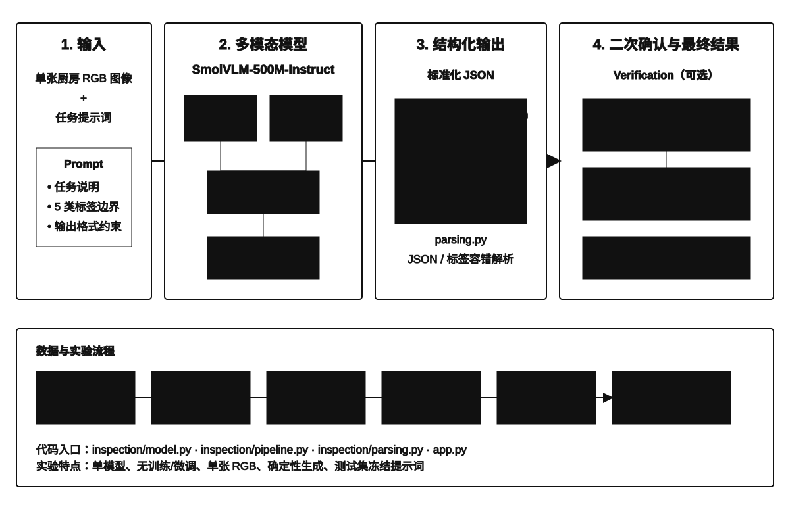

# 轻量厨房安全巡检助手

> 基于 **SmolVLM-500M-Instruct** 的厨房图像安全巡检研究原型。项目不训练、不微调、不调用付费 API，仅使用单张 RGB 厨房图片完成三类可见问题识别，并比较 Direct、Checklist、Structured 和 Verification 四种推理方式。

[](https://www.python.org/)
[](https://huggingface.co/HuggingFaceTB/SmolVLM-500M-Instruct)
[](https://cs.nyu.edu/~fergus/datasets/nyu_depth_v2.html)
[](#代码质量)

## 1. 项目简介

本项目面向家庭厨房安全巡检场景。系统输入一张厨房 RGB 图片，通过轻量视觉语言模型完成图像理解，并输出结构化巡检结果。

系统重点关注三类问题：

- `floor_obstruction`：地面或主要行走区域存在阻碍物；
- `countertop_clutter`：厨房台面或水槽存在明显杂乱、堆积；
- `unsafe_object_placement`：物体与明火、水源、台面边缘等存在明确的不安全位置关系。

此外定义：

- `normal`：图片清晰且没有充分证据支持上述三类问题；
- `uncertain`：图片严重模糊、遮挡或关键区域不可见，无法可靠判断。

项目强调 **evidence-first / 可见证据优先**：不能仅因为图片中出现某个物体，就推断它构成安全问题。

## 2. 核心特点

- **轻量模型**：当前仓库实际使用的是 `HuggingFaceTB/SmolVLM-500M-Instruct`，不是 256M 版本；
- **单模型实验**：所有方法均使用同一个 SmolVLM，不引入第二个视觉模型；
- **无训练**：不进行训练、微调或 LoRA；
- **单张 RGB**：推理阶段只使用厨房 RGB 图像，不使用 NYU Depth V2 的深度图；
- **确定性推理**：`do_sample=False`，固定随机种子；
- **结构化解析**：对模型输出进行 JSON、标签和确认回答解析，并提供容错处理；
- **二次确认**：对初判为问题的样本，可以使用同一个模型再次检查具体视觉证据；
- **可复现实验**：Debug/Test 子集采用固定随机种子进行分层抽样；
- **可视化 Demo**：使用 Gradio 提供图片上传、巡检结果和技术信息展示。

## 3. 模型架构

下面的架构图采用纯黑白设计，展示从图片输入、多模态推理、结构化输出到二次确认和 Demo 的完整流程。

<p align="center">
  
</p>

### 模型说明

项目代码中的模型默认配置位于 `inspection/model.py`：

```python
DEFAULT_MODEL_ID = "HuggingFaceTB/SmolVLM-500M-Instruct"
```

模型加载流程：

```text
厨房 RGB 图像
      │
      ├──────────────┐
      │              │
      ▼              ▼
视觉输入编码       文本 Prompt
      │              │
      └──────┬───────┘
             ▼
      SmolVLM-500M-Instruct
             │
             ▼
       自回归生成文本
             │
             ▼
       JSON / 标签解析
             │
             ▼
       标准化巡检结果
```

推理阶段使用 `AutoProcessor` 完成图像和文本输入处理，并通过 `AutoModelForImageTextToText` 加载模型。CUDA 环境下根据硬件能力自动选择 `bfloat16` 或 `float16`；CPU 使用 `float32`。模型设置为 `eval()`，生成采用 `do_sample=False`。这些行为均可在 `inspection/model.py` 中直接查看。

## 4. 完整技术流程

### 4.1 数据构建

```text
NYU Depth V2 标注版数据
        │
        ▼
筛选 sceneTypes = kitchen
        │
        ▼
厨房候选 RGB 图片
        │
        ▼
人工审核
  ├─ 删除模糊/无效图片
  ├─ 删除不符合任务要求的图片
  └─ 标注问题类别
        │
        ▼
固定随机种子分层抽样
  ├─ Debug：15 张
  └─ Test ：30 张
```

Debug 集用于提示词设计和调试；Test 集在提示词冻结后用于最终评价，避免根据测试集结果反复修改方法。

### 4.2 多模态推理

```text
单张厨房 RGB 图片
        +
任务 Prompt
        │
        ▼
SmolVLM-500M-Instruct
        │
        ▼
原始模型输出
        │
        ▼
parsing.py
        │
        ├── JSON 解析
        ├── 标签标准化
        ├── Evidence 提取
        └── Confirmation 结果解析
        │
        ▼
标准化巡检结果
```

### 4.3 Verification 二次确认

二次确认不是使用另一个模型，而是让**同一个 SmolVLM**针对初步判断再次检查具体视觉证据。

```text
Checklist 初判
      │
      ├── normal ──────────────► 保持 normal
      │
      ├── uncertain ───────────► 保持 uncertain
      │
      └── 三类问题之一
               │
               ▼
       针对该类别构造确认 Prompt
               │
               ▼
       同一个 SmolVLM 再次推理
               │
          ┌────┼────┐
          ▼    ▼    ▼
         yes   no  uncertain
          │    │      │
          ▼    ▼      ▼
        保留  驳回   uncertain
        问题  为normal
```

这种设计主要用于观察：在不改变模型和数据的情况下，增加一次针对性视觉证据核验是否能够减少误报。

## 5. 问题标签边界

| 标签 | 定义 | 典型情况 |
|---|---|---|
| `floor_obstruction` | 地面或主要行走路径存在明确阻碍物 | 箱子、桶、垃圾袋、餐盘、散落物品 |
| `countertop_clutter` | 多个松散物品明显占据台面/水槽空间 | 大量餐具、瓶罐、杂物堆积 |
| `unsafe_object_placement` | 能同时看到物体和明确危险位置关系 | 毛巾靠近明火、刀具位于边缘、电器紧邻水源 |
| `normal` | 图片清晰，且没有充分证据支持三类问题 | 通道畅通、台面正常、物品位置合理 |
| `uncertain` | 关键区域不可见或图像质量不足以判断 | 严重模糊、严重遮挡 |

特别注意：`normal` 和 `uncertain` 不能混用。图片清晰且没有问题应为 `normal`；只是因为看不清而无法判断时才使用 `uncertain`。

## 6. 四种实验方法

| 方法 | 核心思想 | 输出形式 | 目的 |
|---|---|---|---|
| `direct` | 直接询问图片是否存在问题 | 自然语言 | 最简单的开放式基线 |
| `checklist` | 明确类别边界并逐项检查 | Evidence + Decision | 观察任务约束对判断的影响 |
| `structured` | 在 Checklist 基础上加入 JSON schema 约束 | JSON | 同时评价预测与结构化输出能力 |
| `verified` | 对 Checklist 的问题判断进行二次视觉证据确认 | Yes / No / Uncertain | 研究减少误报的可能性 |

提示词位于：

- `inspection/prompts.py`：实际运行使用的提示词；
- `results/prompts_final.py`：最终测试阶段冻结的提示词版本。

## 7. 输出格式

系统最终将模型输出标准化为：

```json
{
  "result": "attention",
  "issue_type": "floor_obstruction",
  "evidence": "A plate is visible on the walking area.",
  "suggestion": "Remove the plate from the walking area."
}
```

字段含义：

- `result`：`normal` / `attention` / `uncertain`；
- `issue_type`：三类问题之一；正常或不确定时为空；
- `evidence`：描述图片中直接可见的证据；
- `suggestion`：简短、可执行的处理建议。

## 8. 实验评价

项目最终测试阶段保存逐图 JSONL，并计算指定指标：

- **Accuracy**：预测标签与人工标注一致的比例；
- **正常图误报数**：人工标注为 `normal` 但模型判断存在问题的数量；
- **JSON 合法率**：模型原始输出能够被结构化解析为合法 JSON 的比例。

### V1.3 最终测试结果

提示词在 Debug 集完成设计后冻结，下面结果来自 30 张 Test 图片；每种方法均使用同一个 `SmolVLM-500M-Instruct`，且每次只输入一张 RGB 图片。

| 方法 | Accuracy | 正常图误报数 | JSON 合法率 |
|---|---:|---:|---:|
| Direct | 0.4667（14/30） | 0 | — |
| Checklist | 0.2000（6/30） | 8 | — |
| Checklist + Verification | 0.3000（9/30） | 5 | — |
| Structured | **0.5667（17/30）** | **3** | **0.8667（26/30）** |

结果表明，结构化提示在本次测试中取得最高准确率和较低误报；二次确认将 Checklist 的误报数由 8 降至 5，同时准确率由 0.2000 提升至 0.3000。另一方面，小型 VLM 对地面障碍和危险摆放的细粒度空间关系仍然较弱，这是后续改进重点。

最终结果文件：

```text
results/
├── test_final_predictions.jsonl
├── test_final_metrics.json
├── test_final_metrics.csv
├── prompts_final.py
├── case_analysis.md
└── data_analysis/
    └── dataset_summary.json
```

## 9. Demo

运行：

```powershell
.\.venv\Scripts\python.exe app.py
```

启动后使用浏览器访问本地 Gradio 页面。

Demo 支持：

1. 上传厨房图片；
2. 选择是否启用 Verification 二次确认；
3. 调用 SmolVLM 完成巡检；
4. 展示问题是否存在、问题类别、视觉证据和处理建议；
5. 查看技术详情。

## 10. 项目结构

```text
home-inspection/
├── inspection/
│   ├── model.py             # SmolVLM 加载、设备选择和单图生成
│   ├── pipeline.py          # 四种方法与二次确认流程
│   ├── prompts.py           # Prompt 定义
│   ├── parsing.py           # JSON、标签和确认回答解析
│   └── schemas.py           # 标准化结果和允许标签
├── data/
│   ├── raw/                 # NYU .mat，本地生成，不提交 Git
│   ├── candidates/          # Kitchen 候选图片，本地生成
│   └── selected/
│       ├── debug/           # Debug 图片，本地保存
│       └── test/            # Test 图片，本地保存
├── results/
│   ├── test_final_predictions.jsonl
│   ├── test_final_metrics.json
│   ├── test_final_metrics.csv
│   ├── prompts_final.py
│   ├── case_analysis.md
│   └── data_analysis/
│       └── dataset_summary.json
├── tests/
│   ├── test_app.py
│   ├── test_parsing.py
│   └── test_pipeline.py
├── docs/
│   └── model_architecture.svg # 黑白模型架构图
├── download_data.py
├── prepare_data.py
├── curate_data.py
├── select_subset.py
├── review_annotations.py
├── analyze_data.py
├── run_model.py
├── evaluate.py
├── app.py
├── requirements.txt
└── requirements-dev.txt
```

## 11. 环境安装

推荐：Windows 10/11、Python 3.10/3.11。项目此前已在 RTX 4050 Laptop GPU（6 GB）环境完成推理实验。

创建虚拟环境：

```powershell
python -m venv .venv
.\.venv\Scripts\Activate.ps1
```

安装依赖：

```powershell
.\.venv\Scripts\python.exe -m pip install -r requirements.txt
```

开发依赖：

```powershell
.\.venv\Scripts\python.exe -m pip install -r requirements-dev.txt
```

## 12. 运行实验

运行模型实验：

```powershell
.\.venv\Scripts\python.exe run_model.py
```

运行评价：

```powershell
.\.venv\Scripts\python.exe evaluate.py
```

运行测试：

```powershell
.\.venv\Scripts\python.exe -m pytest
```

代码规范检查：

```powershell
.\.venv\Scripts\python.exe -m ruff check .
```

当前项目已验证：

```text
21 passed
ruff: All checks passed
```

## 13. 数据与文件管理

原始 NYU 数据、候选图片和最终 Debug/Test 图片均不作为 Git 仓库的核心提交内容。仓库主要保存：

- 数据处理和抽样代码；
- Prompt 和推理代码；
- 评价脚本；
- 测试代码；
- 最终实验统计；
- 代表性失败/成功案例分析；
- 架构图和 Demo 代码。

这样可以避免把大型数据集和大量图片直接提交到 GitHub，同时保持实验流程可复现。

## 14. 研究流程总结

```text
数据准备
   ↓
人工审核与标签定义
   ↓
固定种子构建 Debug / Test
   ↓
冻结 Prompt
   ↓
SmolVLM-500M 单模型推理
   ↓
Direct / Checklist / Structured / Verified
   ↓
统一解析与标准化
   ↓
Accuracy / 正常图误报 / JSON 合法率
   ↓
Gradio Demo 与案例分析
```

项目的核心不是训练一个新的视觉模型，而是研究**轻量视觉语言模型在厨房安全巡检任务中的提示设计、结构化输出和视觉证据二次确认**。