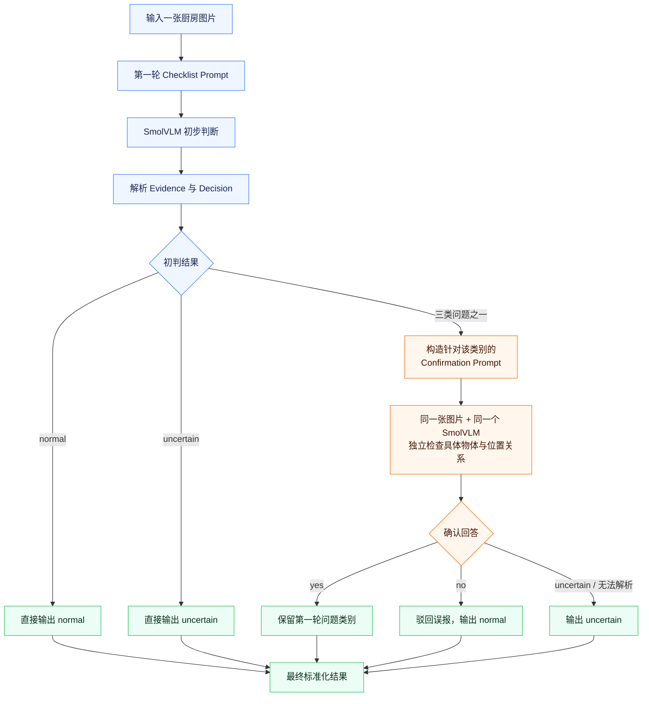

# 轻量厨房安全巡检助手

> 基于 **SmolVLM-500M-Instruct** 的厨房图像安全巡检研究原型：不训练、不微调、不调用付费 API，在单张 RGB 图片上识别三类可见问题，并比较直接提问、检查清单、结构化输出和视觉证据二次确认四种提示方法。

[](https://www.python.org/)
[](https://huggingface.co/HuggingFaceTB/SmolVLM-500M-Instruct)
[](https://cs.nyu.edu/~fergus/datasets/nyu_depth_v2.html)
[](#代码质量检查)

## 项目概览

本项目面向家庭厨房巡检场景。输入一张厨房图片，系统输出：

1. 是否存在明显问题；
2. 问题所属类别；
3. 图片中的直接视觉证据；
4. 简短、可执行的处理建议。

项目严格遵守以下实验约束：

- 只使用一个参数量不超过 0.5B 的视觉语言模型；
- 不训练、不微调，不使用目标检测器或外部付费接口；
- 每次只输入一张 RGB 图片，不使用 NYU 深度图；
- 调试集只用于设计提示词，测试集只用于最终评价；
- 评价只报告 Accuracy、正常图误报数和 JSON 合法率三项指定指标。

### 功能完成情况

| 模块 | 实现内容 | 对应文件 |
|---|---|---|
| 数据下载 | 下载约 2.8 GB 的 NYU Depth V2 标注版 `.mat` | `download_data.py` |
| Kitchen 筛选 | 读取 RGB 与 `sceneTypes`，导出厨房候选图 | `prepare_data.py` |
| 人工审核 | 剔除无效图片，完成划分和单标签标注 | `curate_data.py` |
| 子集构建 | 固定随机种子分层抽取 15/30 张图片 | `select_subset.py` |
| 数据观察 | 数量统计与 8 张代表图拼图 | `analyze_data.py` |
| 模型推理 | 四种提示方法的批量实验 | `run_model.py` |
| 结果评价 | Accuracy、误报数、JSON 合法率 | `evaluate.py` |
| 交互 Demo | 图片上传、巡检结果和技术详情展示 | `app.py` |
| 自动化测试 | 解析、评价、二次确认、界面辅助逻辑 | `tests/` |

## 问题定义与标签边界

系统只允许输出以下五种互斥结果。如果一张图片同时出现多个问题，只报告视觉证据最清晰、影响最明显的一项。

| 标签 | 判定条件 | 典型正例 | 不应判为该类的情况 |
|---|---|---|---|
| `floor_obstruction` | 有明确物体位于地面或主要行走路径 | 地面上的箱子、桶、垃圾袋、餐盘、散落杂物 | 只位于台面、水槽、桌子或灶具上的物品 |
| `countertop_clutter` | 多个松散物品明显占据台面或水槽可用空间 | 大量未清洗餐具、瓶罐和杂物成堆堆放 | 单个家电、少量正常使用的餐具或整齐摆放的物品 |
| `unsafe_object_placement` | 能同时看见具体物品及其危险位置关系 | 毛巾靠近明火、刀具位于台面边缘、电器紧邻水源 | 只有物品而看不出其与热源、水源或边缘的关系 |
| `normal` | 图片清晰，且三类问题均无充分证据 | 通道畅通、台面处于正常使用状态、物品位置合理 | 不能因为“没有看清”而输出 normal |
| `uncertain` | 严重模糊、遮挡或关键区域不可见，无法可靠判断 | 地面完全被遮挡、图像严重失焦 | 图片清晰但没有问题时应输出 normal |

这种边界设计强调“**可见证据优先**”：模型不能因为厨房中出现了某个常见物体，就自动推断危险或杂乱。

## 整体技术架构


```mermaid
flowchart LR
    subgraph A[数据构建]
        A1[NYU Depth V2<br/>标注版 MAT] --> A2[下载与读取<br/>download_data.py]
        A2 --> A3[筛选 sceneTypes = kitchen<br/>prepare_data.py]
        A3 --> A4[225 张候选厨房图]
        A4 --> A5[人工剔除模糊、重复和无效图<br/>curate_data.py]
        A5 --> A6[128 张有效标注]
        A6 --> A7[固定种子分层抽样<br/>select_subset.py]
        A7 --> A8[Debug 15 张<br/>提示词设计]
        A7 --> A9[Test 30 张<br/>最终评价]
    end

    subgraph B[多模态推理]
        B1[单张厨房 RGB] --> B2[AutoProcessor<br/>图像与文本联合编码]
        B3[Direct / Checklist /<br/>Structured Prompt] --> B2
        B2 --> B4[SmolVLM-500M-Instruct<br/>do_sample = False]
        B4 --> B5[原始文本或 JSON 输出]
        B5 --> B6[严格 JSON / 标签解析 /<br/>容错回退]
        B6 --> B7{是否启用<br/>视觉证据确认}
        B7 -->|否| B9[标准化巡检结果]
        B7 -->|是| B8[同一模型第二次核验<br/>yes / no / uncertain]
        B8 --> B9
    end

    subgraph C[评价与交互]
        C1[逐图预测 JSONL] --> C2[evaluate.py]
        C2 --> C3[Accuracy]
        C2 --> C4[正常图误报数]
        C2 --> C5[JSON 合法率]
        C6[Gradio Demo] --> C7[问题类别、证据、建议<br/>与模型调试信息]
    end

    A8 --> B3
    A9 --> B1
    B9 --> C1
    B9 --> C6

    classDef data fill:#eff6ff,stroke:#3b82f6,color:#172554;
    classDef model fill:#fff7ed,stroke:#f97316,color:#431407;
    classDef output fill:#ecfdf5,stroke:#22c55e,color:#052e16;
    class A1,A2,A3,A4,A5,A6,A7,A8,A9 data;
    class B1,B2,B3,B4,B5,B6,B7,B8 model;
    class B9,C1,C2,C3,C4,C5,C6,C7 output;
```

架构由三个部分组成：

- **数据构建层**：从 NYU 标注版数据读取 Kitchen RGB，经过人工审核、单标签标注和固定种子分层抽样形成最终数据集；
- **多模态推理层**：将图片与提示词送入同一个 SmolVLM，通过不同输出约束形成四种实验方法；
- **评价与交互层**：批量实验保存逐图记录并计算指定指标，Demo 则将同一推理流程封装为可视化界面。

## 四种提示方法

| 方法 | 提示方式 | 输出解析 | 研究目的 |
|---|---|---|---|
| `direct` | “检查图片中是否存在明显问题” | 自然语言标签映射 | 作为最简单的开放式基线 |
| `checklist` | 明确三类问题、正常和不确定的边界 | 两行 `Evidence + Decision` | 观察类别说明能否改善判断 |
| `structured` | 检查清单 + JSON 字段和值域约束 | 严格 JSON，失败时容错回退 | 同时评价标签准确率与 JSON 合法率 |
| `verified` | 复用 checklist 初判；报告问题时再次核验证据 | `yes / no / uncertain` | 检验二次确认能否减少误报 |

实际提示词位于 [`inspection/prompts.py`](inspection/prompts.py)，最终测试使用的冻结版本保存在 [`results/prompts_final.py`](results/prompts_final.py)。测试集运行完成后不再根据测试结果修改提示词。

### 二次确认决策流程


```mermaid
flowchart TD
    I[输入一张厨房图片] --> P1[第一轮 Checklist Prompt]
    P1 --> M1[SmolVLM 初步判断]
    M1 --> R1[解析 Evidence 与 Decision]
    R1 --> Q{初判结果}

    Q -->|normal| N[直接输出 normal]
    Q -->|uncertain| U[直接输出 uncertain]
    Q -->|三类问题之一| P2[构造针对该类别的<br/>Confirmation Prompt]

    P2 --> M2[同一张图片 + 同一个 SmolVLM<br/>独立检查具体物体与位置关系]
    M2 --> D{确认回答}
    D -->|yes| K[保留第一轮问题类别]
    D -->|no| N2[驳回误报，输出 normal]
    D -->|uncertain / 无法解析| U2[输出 uncertain]

    N --> O[最终标准化结果]
    U --> O
    K --> O
    N2 --> O
    U2 --> O

    classDef first fill:#eff6ff,stroke:#3b82f6,color:#172554;
    classDef verify fill:#fff7ed,stroke:#f97316,color:#431407;
    classDef final fill:#ecfdf5,stroke:#22c55e,color:#052e16;
    class I,P1,M1,R1,Q first;
    class P2,M2,D verify;
    class N,U,K,N2,U2,O final;
```

`verified` 不是第二个模型，也不是重新训练后的模型。它复用第一轮 `checklist` 结果，仅在初判为问题时使用同一个 SmolVLM 进行一次针对性证据核验。批量实验中复用同一次初判，从而可以逐图公平比较确认前后的变化。

## 标准化输出

结构化结果统一为四个字段：

```json
{
  "result": "attention",
  "issue_type": "floor_obstruction",
  "evidence": "A plate is visible on the walking area.",
  "suggestion": "Remove the plate from the walking area."
}
```

字段约束：

- `result`：只能是 `normal`、`attention` 或 `uncertain`；
- `issue_type`：问题样本只能填写三类标签之一，正常和不确定样本必须为空字符串；
- `evidence`：只描述图中可以直接看到的物体及其位置；
- `suggestion`：给出简短处理措施，不扩展到图中无法确认的风险。

## 项目结构

```text
home-inspection/
├── inspection/
│   ├── model.py             # 模型加载、设备选择和单图生成
│   ├── pipeline.py          # 四种方法与二次确认流程
│   ├── prompts.py           # Direct、Checklist、Structured、Confirmation 提示词
│   ├── parsing.py           # JSON、标签和确认回答解析
│   └── schemas.py           # 标准化结果数据结构与允许标签
├── data/
│   ├── raw/                 # NYU .mat（本地生成，不提交 Git）
│   ├── candidates/          # Kitchen 候选图片（本地生成）
│   └── selected/
│       ├── debug/           # 最终调试集图片（不提交原图）
│       └── test/            # 最终测试集图片（不提交原图）
├── results/
│   ├── test_final_predictions.jsonl  # 30 张测试图的逐方法预测
│   ├── test_final_metrics.json       # 完整评价结果与混淆统计
│   ├── test_final_metrics.csv        # 三项指标汇总
│   ├── prompts_final.py              # 冻结后的最终提示词
│   ├── case_analysis.md              # 两个正确案例与两个失败案例
│   └── data_analysis/
│       └── dataset_summary.json      # 最终数据集统计
├── tests/                    # 无需下载模型即可运行的自动化测试
├── download_data.py          # 下载 NYU 标注版数据
├── prepare_data.py           # 筛选 Kitchen 场景并导出 RGB
├── curate_data.py            # 人工筛选、划分和标注界面
├── select_subset.py          # 固定种子分层抽取最终 45 张图片
├── review_annotations.py     # 逐张复核最终人工标签
├── analyze_data.py           # 数据统计与代表图拼图
├── run_model.py              # 批量运行四种提示方法
├── evaluate.py               # 计算指定指标
├── app.py                    # Gradio Demo
├── requirements.txt
└── requirements-dev.txt
```

## 环境安装

推荐环境：Windows 10/11、Python 3.10 或 3.11。项目已在 RTX 4050 Laptop GPU（6 GB）上完成实验，也支持 CPU 推理。

### 1. 创建虚拟环境

```powershell
git clone https://github.com/RuichenLiu222/home-inspection.git
cd home-inspection
py -3.11 -m venv .venv
.\.venv\Scripts\Activate.ps1
python -m pip install --upgrade pip
pip install -r requirements.txt
```

### 2. 配置 GPU（可选）

根据 [PyTorch 官方安装页](https://pytorch.org/get-started/locally/) 安装与本机环境匹配的 CUDA 版本，然后检查：

```powershell
python -c "import torch; print('PyTorch:', torch.__version__); print('CUDA:', torch.cuda.is_available()); print('GPU:', torch.cuda.get_device_name(0) if torch.cuda.is_available() else 'CPU')"
```

模型权重约 1 GB。磁盘空间紧张时可以把 Hugging Face 缓存移到其他盘：

```powershell
$env:HF_HOME="D:\hf-cache"
setx HF_HOME "D:\hf-cache"
```

## 数据构建

### 1. 下载与导出 Kitchen RGB

```powershell
python download_data.py
python prepare_data.py
```

项目只下载约 2.8 GB 的标注版文件，不下载约 428 GB 的原始视频数据。`prepare_data.py` 读取 `images` 与 `sceneTypes`，筛选场景类型严格等于 `kitchen` 的图片，输出：

- `data/candidates/*.jpg`：厨房候选 RGB；
- `data/candidates.jsonl`：文件路径、图像尺寸和简单清晰度信息。

### 2. 人工筛选与标注

```powershell
python curate_data.py
```

打开 `http://127.0.0.1:7861` 后逐张审核：

1. 严重模糊、损坏、重复或无效图片选择 `reject`；
2. 有效图片只选择一个主要标签；
3. 指定图片属于 `debug` 还是 `test`；
4. 不参考模型输出修改人工标签。

单条标注格式示例：

```json
{"image": "data/selected/test/kitchen_0898.jpg", "label": "floor_obstruction", "split": "test"}
```

标注工具每处理一张图片都会保存进度，可以随时通过 `Ctrl+C` 退出后重新运行。

### 3. 分层抽样与最终复核

本项目人工审核 225 张候选图，剔除 97 张无效图，得到 128 张有效标注。随后使用固定随机种子分层抽取 45 张：

```powershell
Copy-Item data\annotations.jsonl data\annotations_all_128.jsonl
python select_subset.py
Copy-Item data\annotations.jsonl data\annotations_before_review.jsonl
python review_annotations.py
```

最终划分与标签分布：

| 划分 | 数量 |
|---|---:|
| Debug | 15 |
| Test | 30 |
| **合计** | **45** |

| 标签 | 数量 |
|---|---:|
| `floor_obstruction` | 6 |
| `countertop_clutter` | 11 |
| `unsafe_object_placement` | 3 |
| `normal` | 21 |
| `uncertain` | 4 |

### 4. 数据观察

```powershell
python analyze_data.py --representatives 8
```

本地生成：

- `results/data_analysis/dataset_summary.json`：划分与类别数量；
- `results/data_analysis/representative_images.jpg`：8 张代表性图片拼图。

公开仓库保留统计文件，但不重新分发 NYU 原图或包含原图的 Demo 截图。

## 运行实验

### 1. 调试集设计提示词

```powershell
python run_model.py --split debug --methods all --device cuda --output results/debug_predictions.jsonl
```

建议先运行单张冒烟测试：

```powershell
python run_model.py --split debug --methods all --device cuda --limit 1 --output results/debug_smoke.jsonl
```

### 2. 冻结提示词并运行测试集

```powershell
Copy-Item inspection\prompts.py results\prompts_final.py -Force
python run_model.py --split test --methods all --device cuda --output results/test_final_predictions.jsonl
```

运行设置采用 `do_sample=False` 和固定随机种子，减少生成波动。每条 JSONL 记录包含图片路径、人工标签、方法、原始输出、标准化结果、解析策略、耗时以及可选的二次确认信息。

## 评价指标与最终结果

```powershell
python evaluate.py --predictions results/test_final_predictions.jsonl --output results/test_final_metrics.json
```

### 指标定义

- **Accuracy**：预测标签与人工单标签完全一致的图片比例；
- **正常图误报数**：人工标签为 `normal`，模型却输出三类问题之一的图片数量；
- **JSON 合法率**：结构化方法的原始输出无需清洗即可被 `json.loads()` 解析的比例。

Demo 可以对 Markdown 代码块等格式进行容错解析，但这类输出在正式 JSON 合法率中仍记为不合法，避免指标被后处理虚高。

### 30 张测试图结果

| 方法 | 正确数 | Accuracy | 正常图误报数 | JSON 合法率 |
|---|---:|---:|---:|---:|
| `direct` | 14/30 | 46.67% | 0 | — |
| `checklist` | 7/30 | 23.33% | 14 | — |
| `verified` | 13/30 | 43.33% | 8 | — |
| `structured` | **17/30** | **56.67%** | **3** | **86.67%（26/30）** |

### 结果分析

1. **结构化提示取得最高准确率。** JSON 字段和值域约束减少了输出歧义，最终达到 56.67% Accuracy 和 86.67% 原始 JSON 合法率。
2. **二次确认明显抑制检查清单误报。** `checklist → verified` 的正确数从 7 提高到 13，Accuracy 提高 20 个百分点；正常图误报从 14 降至 8，下降 42.9%。
3. **直接提问存在“全判正常”倾向。** `direct` 将 30 张测试图中的 27 张判为 `normal`，表面准确率主要来自测试集中 14 张正常图，异常识别能力较弱。
4. **小模型难以理解危险空间关系。** 所有方法对 `unsafe_object_placement` 的识别均较弱，容易把“毛巾靠近炉具”等关系错误简化为普通台面杂乱。
5. **二次确认仍有标签锚定。** 它可以保留或驳回第一轮类别，却不能把错误类别改成另一正确类别，也可能继续相信第一轮产生的错误证据。

完整混淆统计见 [`results/test_final_metrics.json`](results/test_final_metrics.json)，逐图输出见 [`results/test_final_predictions.jsonl`](results/test_final_predictions.jsonl)。

## 正确与失败案例

| 案例 | 人工标签 | Checklist 初判 | 二次确认后 | 说明 |
|---|---|---|---|---|
| `kitchen_0898.jpg` | `floor_obstruction` | `floor_obstruction` | `floor_obstruction` | 地面餐盘形成明确行走障碍，确认回答 `yes` |
| `kitchen_0907.jpg` | `normal` | `countertop_clutter` | `normal` | 第二轮证据不足，成功驳回误报 |
| `kitchen_0829.jpg` | `normal` | `floor_obstruction` | `floor_obstruction` | 把家具边缘或远处物体误认为障碍，确认仍受初判锚定 |
| `kitchen_0128.jpg` | `unsafe_object_placement` | `countertop_clutter` | `countertop_clutter` | 识别到物品但未理解毛巾与炉具的危险位置关系 |

详细分析见 [`results/case_analysis.md`](results/case_analysis.md)。

## 启动 Demo

```powershell
python app.py --device cuda
```

CPU 模式：

```powershell
python app.py --device cpu
```

浏览器打开 `http://127.0.0.1:7860`，上传厨房图片并点击“开始巡检”。界面展示：

- 是否存在明显问题；
- 问题类别；
- 可见判断依据；
- 简单处理建议；
- 标准化 JSON、原始输出、解析策略和确认状态。

Demo 中未勾选“启用视觉证据二次确认”时运行 `checklist`，勾选后运行 `verified`。若问题类别已确定但模型没有生成建议，界面只补充预先定义的类别建议，不改变实验预测标签和评价结果。

## 代码质量检查

```powershell
pip install -r requirements-dev.txt
ruff check .
pytest
```

当前版本结果：

```text
All checks passed!
16 passed
```

自动化测试不下载模型或完整数据，覆盖：

- 严格 JSON 合法性与容错解析口径；
- 标签文本和确认回答解析；
- checklist 与 verified 的复用及分支逻辑；
- Accuracy、误报数和 JSON 合法率计算；
- NYU `.mat` RGB 轴顺序转换；
- Demo 方法选择和建议补全逻辑。

GitHub Actions 为手动触发模式，可在仓库的 **Actions → tests → Run workflow** 中运行。

## 常见问题

### 第一次推理为什么较慢？

首次运行需要从 Hugging Face 下载约 1 GB 的模型权重并加载到 CPU/GPU。模型缓存完成后，后续启动不再重复完整下载。

### 为什么仓库中没有测试图片？

NYU Depth V2 原始图片及包含原图的截图不在公开仓库中重新分发。运行数据脚本并按照 README 完成筛选后即可复现实验目录。

### 为什么 JSON 能被程序恢复，却仍统计为不合法？

JSON 合法率评价的是模型原始输出。代码块包裹、缺少外层花括号或额外说明文字都属于原始格式错误；容错恢复只用于提高 Demo 可用性。

### 为什么二次确认后结果可能更差？

500M 小模型可能受到第一轮标签和证据文本的锚定。二次确认是本项目研究的简单改进方法，不保证对每张图片都有效，因此同时保留正确案例和失败案例进行分析。

### PowerShell 查看中文 JSONL 出现乱码怎么办？

显式指定 UTF-8：

```powershell
Get-Content results\test_final_predictions.jsonl -Encoding UTF8
```

## 已知限制

- 测试集只有 30 张图片，指标波动较大，不能代表真实家庭场景的完整分布；
- NYU Depth V2 图像分辨率和拍摄年代有限，与手机照片存在域差异；
- 使用单标签评价，多问题共存时只保留一个主要标签；
- 500M 模型容易出现类别偏置、物体幻觉和空间关系理解错误；
- 二次确认只能保留或驳回原类别，无法重新分类；
- Demo 的模板建议只用于可读性展示，不等同于专业安全建议。

本项目是推免考核性质的研究原型，不应直接用于火灾、燃气泄漏或人身安全相关的自动决策。

## 模型、数据与参考资料

- 模型：[HuggingFaceTB/SmolVLM-500M-Instruct](https://huggingface.co/HuggingFaceTB/SmolVLM-500M-Instruct)，Apache-2.0；
- 官方介绍：[SmolVLM: Redefining small and efficient multimodal models](https://huggingface.co/blog/smolvlm)；
- 数据集：[NYU Depth Dataset V2](https://cs.nyu.edu/~fergus/datasets/nyu_depth_v2.html)；
- Nathan Silberman et al., *Indoor Segmentation and Support Inference from RGBD Images*, ECCV 2012；
- Andrés Marafioti et al., *SmolVLM: Redefining Small and Efficient Multimodal Models*, 2025；
- Yifan Li et al., *Evaluating Object Hallucination in Large Vision-Language Models*, EMNLP 2023；
- Bin Xiao et al., *Florence-2: Advancing a Unified Representation for a Variety of Vision Tasks*, CVPR 2024。

## 说明

该仓库保留了完整代码、冻结提示词、最终逐图预测、评价指标和案例分析，以便复核实验流程。NYU 数据、模型缓存、虚拟环境和本地人工标注池均通过 `.gitignore` 排除。
